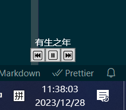

# spotify-control
方便在Windows下快速控制spotify的播放状态

# 用法
> [!WARNING]
> 目前的所有信息均为明文保存，请自行注意密码安全
> 因为设置透明展示的原因，无法主动关闭，终端Ctrl+C也不可以，就算杀掉了，程序也会存在，并且无法使用，正确的退出办法为任务管理器中找到该进程后杀
> 掉即可（目前不考虑修改这个问题，因为本意就是想要进程持续存在，且目前未找到合适办法处理）,在任务管理器里面可以找到一个`Windows PowerShell`(PowerShell 5.1)或`pwsh`(PowerShell 7)的进程，杀掉即可，如果存在多个，嗯……，自己尝试吧 -_-
> 建议迁移到PowerShell 7的版本，因为7的版本对于日常使用兼容性更好，如果是5.x版本，`控制面板—>时钟和区域—>区域->管理—>更改系统区域设置`勾选`使用 Unicode UTF-8 提供全球语音支持`
1. 需要你拥有Spotify Premium，申请[Spotidy开发者](https://developer.spotify.com/dashboard)权限
2. 在Dashboard创建一个app，拥有Web API即可，记得设置它的redirectURI
3. 在仓库所在的目录下创建`client`文件，格式如下：
    ```json
    {
        "clientID" : "**********************",
        "clientSecret": "**********************",
        "redirectURI": "http://localhost:9000/callback"
    }
    ```
4. 运行`ui.ps1`，第一次启动会跳转浏览器进行授权，授权完成后即可正常使用

# 效果


